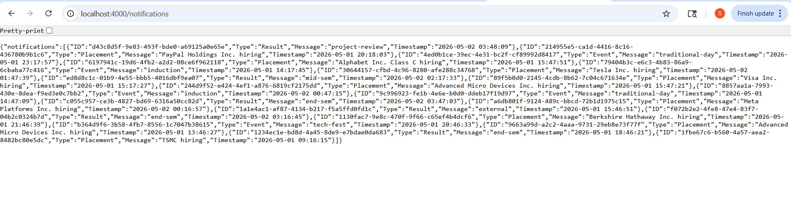
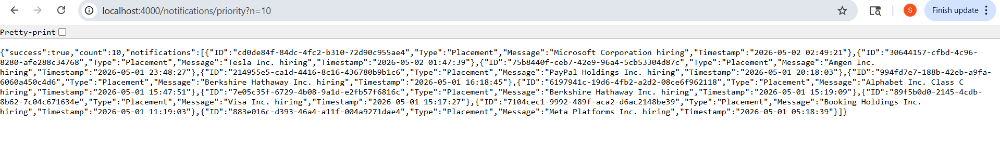
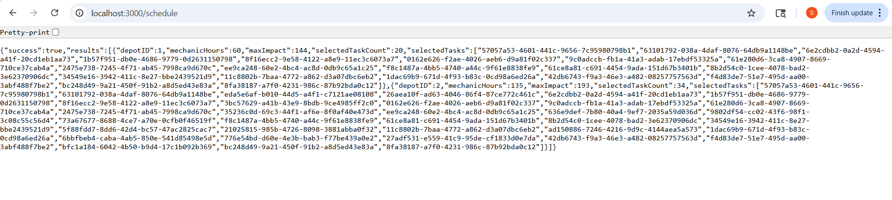

# Notification System Design

---

## Stage 1 — REST API & Real-Time

I built five endpoints under `/api/v1/notifications`. Every request needs a JWT in the
`Authorization: Bearer <token>` header — the server decodes it to get `student_id` and scopes
all queries to that student so no one can read someone else's data.

| Method | Endpoint | What it does |
|---|---|---|
| GET | `/notifications` | Returns all notifications, newest first |
| GET | `/notifications/:id` | Returns one by UUID |
| PATCH | `/notifications/:id/read` | Marks one as read |
| PATCH | `/notifications/read-all` | Marks everything as read in one shot |
| DELETE | `/notifications/:id` | Removes it permanently |

A typical GET response looks like:
```json
{
  "success": true,
  "data": [{ "id": "uuid", "type": "Placement", "message": "Drive on 10 May", "is_read": false, "created_at": "2024-05-01T09:00:00Z" }],
  "unread_count": 1
}
```



For real-time delivery I used WebSockets instead of polling. The server keeps a map of
`student_id → socket`. The moment a new notification is inserted, it pushes:
```json
{ "event": "new_notification", "data": { "id": "uuid", "type": "Placement", "message": "...", "created_at": "iso" } }
```
The client appends it to the list instantly — no page refresh, no repeated GET calls.



---

## Stage 2 — Database

I went with PostgreSQL because the data is naturally relational — students own notifications, and
I want the database to enforce that, not my app code. With `ON DELETE CASCADE`, removing a student
automatically cleans up all their rows. PostgreSQL's ACID guarantees also matter here: when I run
`mark-all-read` I need every row to update or none — partial updates would be confusing for users.

```sql
CREATE TYPE notification_type AS ENUM ('Placement', 'Event', 'Result');

CREATE TABLE students (
  id SERIAL PRIMARY KEY,
  name VARCHAR(255), email VARCHAR(255) UNIQUE,
  created_at TIMESTAMP DEFAULT NOW()
);

CREATE TABLE notifications (
  id UUID PRIMARY KEY DEFAULT gen_random_uuid(),
  student_id INTEGER NOT NULL REFERENCES students(id) ON DELETE CASCADE,
  type notification_type NOT NULL,
  message TEXT NOT NULL,
  is_read BOOLEAN DEFAULT FALSE,
  created_at TIMESTAMP DEFAULT NOW()
);
```

The four queries I use throughout the app:
```sql
-- fetch unread
SELECT id, type, message, is_read, created_at FROM notifications
WHERE student_id = $1 AND is_read = FALSE ORDER BY created_at DESC;

-- mark one read
UPDATE notifications SET is_read = TRUE WHERE id = $1 AND student_id = $2;

-- mark all read
UPDATE notifications SET is_read = TRUE WHERE student_id = $1 AND is_read = FALSE;

-- delete one
DELETE FROM notifications WHERE id = $1 AND student_id = $2;
```

Once the table grows past a few million rows I'd add monthly range partitioning on `created_at`
and move older partitions to cheaper storage.



---

## Stage 3 — Making Queries Fast

The fetch-unread query is logically correct — it returns the right rows in the right order. The
problem is that without an index, PostgreSQL reads every row in the table one by one (a sequential
scan). At 5 million rows and 100 concurrent users, that's half a billion row comparisons per
second, which kills performance fast.

The fix is a composite index that matches the query exactly:
```sql
CREATE INDEX idx_notifications_student_unread
ON notifications (student_id, is_read, created_at DESC);
```
Now Postgres jumps straight to the right rows via the B-tree — cost goes from O(N) to
O(log N + K) where K is the number of results for that one student.

I didn't index every column because each index has to be kept up to date on every write. More
indexes = slower inserts. The rule I follow: only index what you actually filter or sort on.

For finding students who got Placement notifications in the last 7 days:
```sql
SELECT DISTINCT student_id FROM notifications
WHERE type = 'Placement' AND created_at >= NOW() - INTERVAL '7 days';

-- partial index to keep this fast (only stores Placement rows)
CREATE INDEX idx_placement_recent ON notifications (created_at DESC) WHERE type = 'Placement';
```

---

## Stage 4 — Caching

I added Redis in front of the read query with a 60-second TTL. On a cache hit the DB never gets
touched. On any write (PATCH or DELETE) I immediately delete the cached key so the next read is
always fresh. TTL alone would leave stale data up to 60 s after a write; explicit invalidation
fixes that. TTL is still useful as a safety net in case a bug ever skips the invalidation.

For live users, the WebSocket push described in Stage 1 makes caching less critical for new
arrivals — they appear instantly without a cache or DB read. Redis mainly helps with the initial
load and for clients that aren't on a WebSocket connection.

---

## Stage 5 — Sending Notifications to Everyone

The original pseudocode had a loop that inserted one DB row and sent one email per student — that's
50,000 individual database round-trips and synchronous SMTP calls inside the same function. Any
email provider timeout blocks the entire batch, and if the DB fails mid-loop some students got
emails for notifications that were never saved — you can't unsend an email.

The fix is to separate concerns: commit all DB rows first in a single batch, then hand off
delivery to an async queue.

```
function notify_all(student_ids, message, type):
    # one DB round-trip for everything
    batch_insert_db([(sid, message, type) for sid in student_ids])

    # queue delivery — fast, non-blocking
    for sid in student_ids:
        enqueue(email_queue, { sid, message })
        enqueue(push_queue,  { sid, message })

email_worker():
    while true:
        job = dequeue(email_queue)
        for attempt in 1..3:
            try: send_email(job.sid, job.message); break
            catch TransientError: sleep(200ms * 2^attempt)
        on final failure: dead_letter_queue.push(job)
```

DB commits atomically. Workers retry with exponential backoff. Permanent failures go to a
dead-letter queue for inspection rather than disappearing silently.

---

## Stage 6 — Priority and Top-N

I rank notifications using: `score = type_weight × 10¹² + timestamp_ms`

Weights: Placement = 3, Result = 2, Event = 1. The `10¹²` gap is large enough that type always
wins — a Placement from yesterday always outranks an Event from today, no matter what.

To keep the top-N list up to date as new notifications stream in, I use a min-heap of fixed size
N (smallest score sits at the root):

```
on new notification n:
    s = weight(n.type) * 1e12 + epoch_ms(n.created_at)
    if heap.size() < N:       heap.push(s, n)
    elif s > heap.root().score: heap.pop(); heap.push(s, n)

get_top_N(): return heap.sorted_descending()
```

Each insert costs O(log N) and the heap never grows beyond N entries, so memory stays constant
no matter how many notifications come in.
